# Acceso seguro con Nginx

<p align="left">

</p>

## Índice

1. [Introducción](#introducción)
2. [Instalación de Tomcat](#instalación-de-tomcat)
3. [Configuración de la administración](#configuración-de-la-administración)
4. [Despliegue manual mediante GUI](#despliegue-manual-mediante-gui)
5. [Despliegue con Maven](#despliegue-con-maven)
6. [Tarea](#tarea)
7. [Referencias](#referencias)


---


## Introducción

En esta práctica se realizará la instalación de un servidor web con Tomcat y Maven.

## Instalación de Tomcat

Para instalar Tomcat primero debemos instalar Java, por lo que ejecutamos el siguiente comando:

```
sudo apt install -y openjdk-11-jdk
```

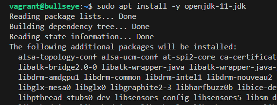

Posteriormente instalamos Tomcat:

```
sudo apt install -y tomcat9
```

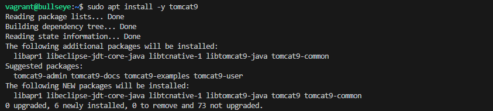

Ahora crearemos el grupo de usuarios de Tomcat:

```
sudo groupadd tomcat9
```

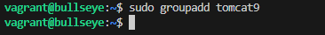

Creamos el usuario de Tomcat:

```
sudo useradd -s /bin/false -g tomcat9 -d /etc/tomcat9 tomcat9
```

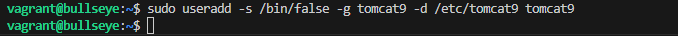

Y arrancamos el servicio de Tomcat:

```
sudo systemctl start tomcat9
```

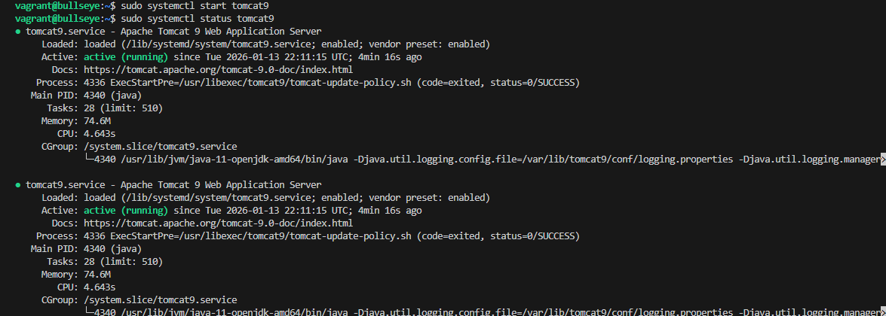

Deberemos tener para la siguiente ruta este paquete instalado:

```
sudo apt install -y tomcat9-admin
```

Para el acceso remoto a Tomcat debemos modificar el archivo de configuración de context.xml:

```
sudo nano /usr/share/tomcat9-admin/host-manager/META-INF/context.xml
```

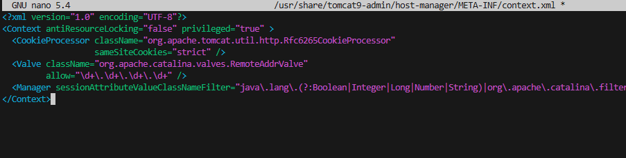

Y se veria en nuestro navegador de la siguiente manera:

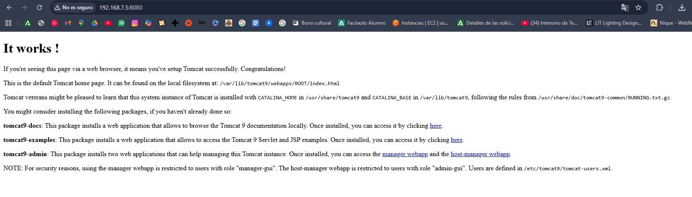

## Configuración de la administración

Para el acceso remoto a la administración de Tomcat debemos modificar el archivo de configuración de tomcat-users.xml:

```
sudo nano /etc/tomcat9/tomcat-users.xml
```

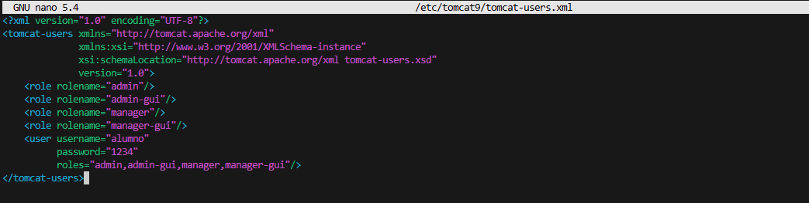

Accederemos a la web a la con Accede a http://192.168.7.5:8080/manager/html:

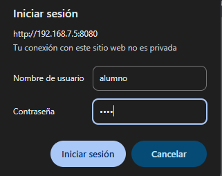

Y se veria en nuestro navegador de la siguiente manera:

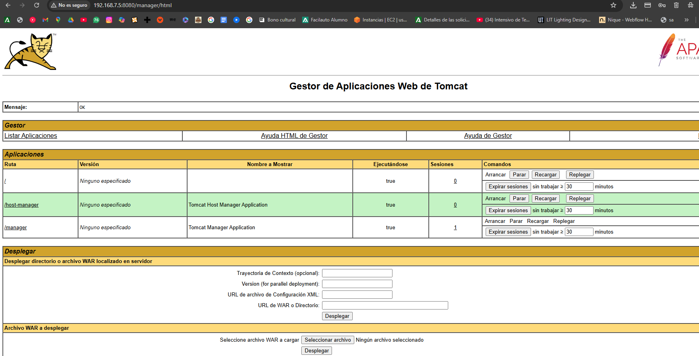

## Despliegue manual mediante GUI

Para seleccionar el archivo .war deberemos clicar en clicar archivo y desde ahi buscarlo en nuestro equipo en este apartado:

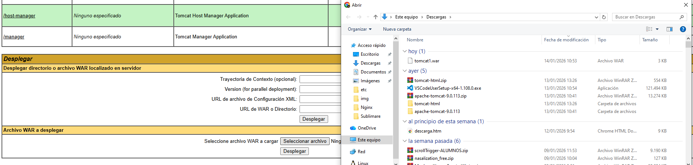

Una vez seleccionado deberia de aparecer algo asi:

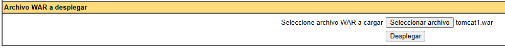

Le daremos a desplegar y se veria este resultado:

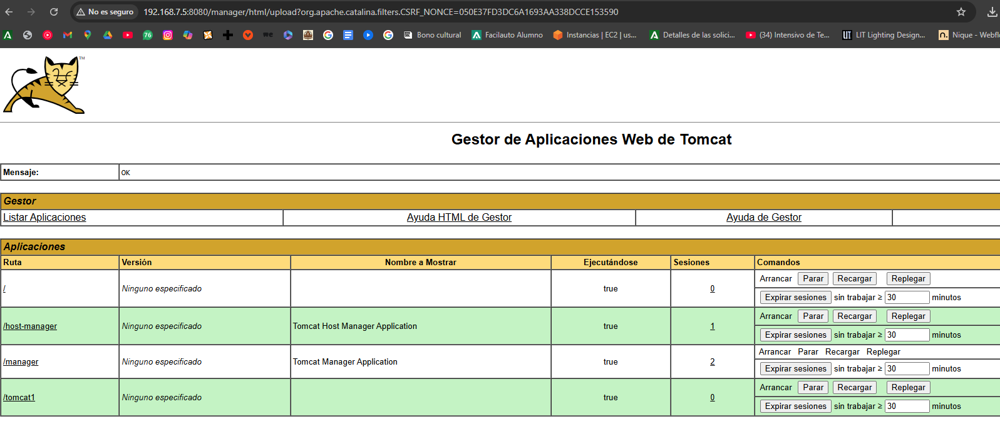

## Instalación de Maven

Para instalar Maven ejecutamos el siguiente comando:

```
sudo apt-get update && sudo apt-get -y install maven
```

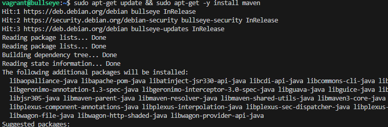

Podremos comprobar que se ha instalado correctamente con:
```
mvn --v
```

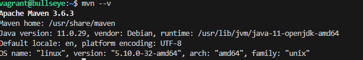

Añadimos nuevo usuario delay con su contraseña en el archivo tomcat-users.xml:

```
sudo nano /etc/tomcat9/tomcat-users.xml
```

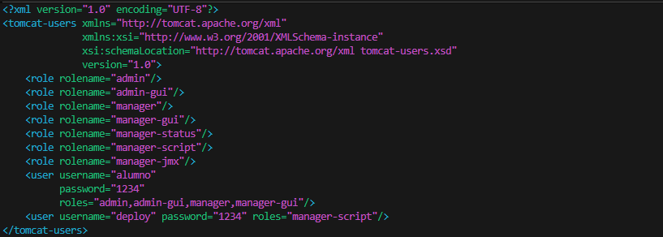

Y en el archivo /etc/maven/settings.xml añadimos el usuario delay con su contraseña:

```
sudo nano /etc/maven/settings.xml
```

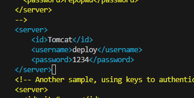

Para lanzar una aplicacion de ejemplo lo haremos:

```
mvn archetype:generate -DgroupId=org.ejemplo -DartifactId=tomcat-war-deployment -DarchetypeArtifactId=maven-archetype-webapp -DinteractiveMode=false
```

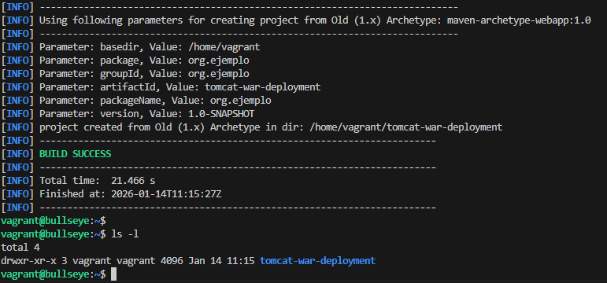


